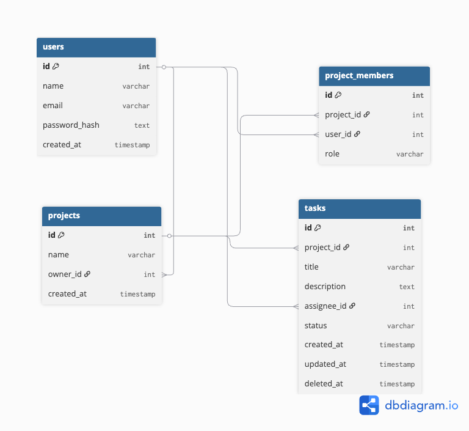

# Team Task Manager API

チームで利用することを想定したタスク管理APIです。  
Spring Boot + PostgreSQL を使用して開発しています。

---

## Tech Stack

- Java
- Spring Boot
- PostgreSQL
- Docker（予定）
- AWS（予定）

---

## ER Diagram



---

## Features

- ユーザー登録
- ログイン認証（JWT予定）
- プロジェクト作成
- プロジェクトメンバー管理
- タスク作成
- タスク担当者アサイン
- ステータス管理（TODO / DOING / DONE）

---

## API Example

```
POST /users
POST /login
GET /projects
POST /projects
GET /projects/{id}/tasks
POST /tasks
PATCH /tasks/{id}
DELETE /tasks/{id}
```

---

## Future Improvements

- JWT認証
- Docker対応
- AWSデプロイ
- CI/CD（GitHub Actions）
